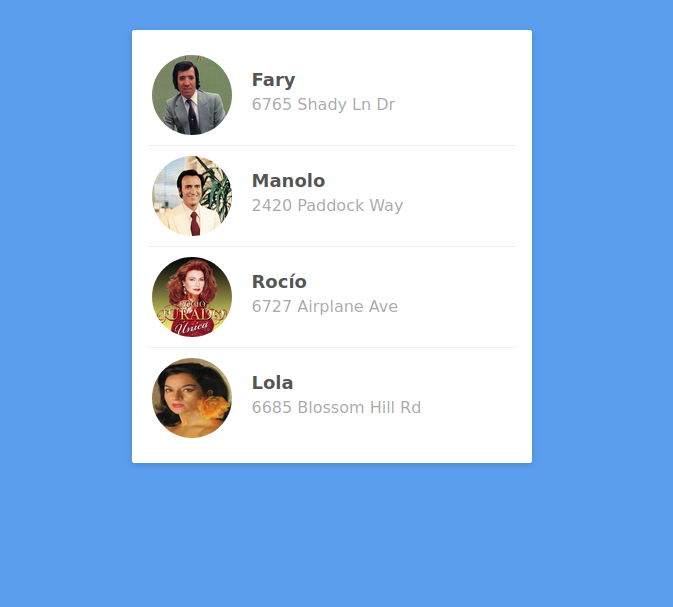

# Contactos copleros 

## Introducción 

Dadas las imágenes en la carpeta `assets`, tendrás que replicar el listado de contactos arriba mostrado.

## Requisitos ##

- HTML

- CSS Flexbox

## Iteraciones ##

1. Crea el HTML, teniendo especial consideración en la semántica.

2. Agrega el CSS. Es obligado el uso de flexbox.
