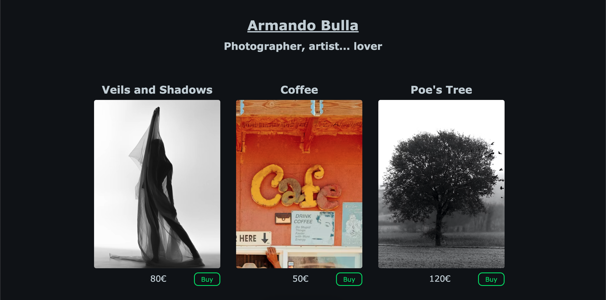
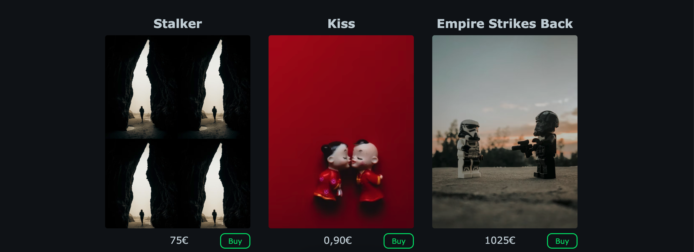

# Ejercicio CSS - Galería de imágenes

### Introducción

El famoso fotógrafo, artista y timador mexicano **Armando Bulla** te ha contactado para que le ayudes con su trabajo. Necesita una web que muestre su arte al mundo y, de paso, le sirva para ganar unos dineros. Por eso, tienes que construir una página que sirva de galería para sus fotos.

El resultado debe de ser el siguiente:

### Iteraciones
1. Crea un repositorio en GitHub y clónalo en tu ordenador. Crea la estructura de carpetas apropiada para un proyecto frontend.
2. Descárgate las imágenes del repositorio y guárdalas en tu carpeta de **assets**.
3. Haz el HTML, prestando atención a la **semántica**. Las imágenes deben ser el background de un elemento `div` que debe medir obligatoriamente `300px` de ancho por `400px` de alto.
4. Haz el CSS y trata de que las imágenes queden como en el ejemplo de arriba. Para ello deberás hacer uso de tus conocimientos de `background-position` y `background-size`. Trata de que todo se parezca lo más posible (tamaño de letra, colores, espacios, etc.).
5. Para copiar los colores, puedes hacer uso de la extensión de Google Chrome [ColorZilla](https://chrome.google.com/webstore/detail/colorzilla/bhlhnicpbhignbdhedgjhgdocnmhomnp?hl=en).
6. Guarda tu trabajo y súbelo a GitHub.