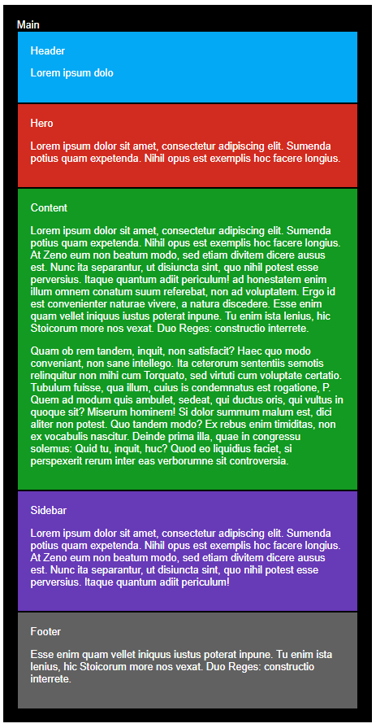
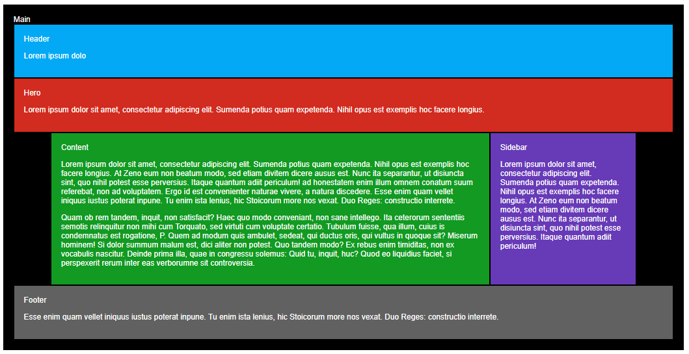

## Introducción
En este ejercicio haremos una página completamente "responsive" con la estrategia de "mobile first", que no es otra cosa que realizar el diseño para móvil inicialmente, e ir extendiendo la programación hacia resoluciones o tamaños de pantalla mayores.

### Vista mobile

### Vista tablet

### Vista desktop
