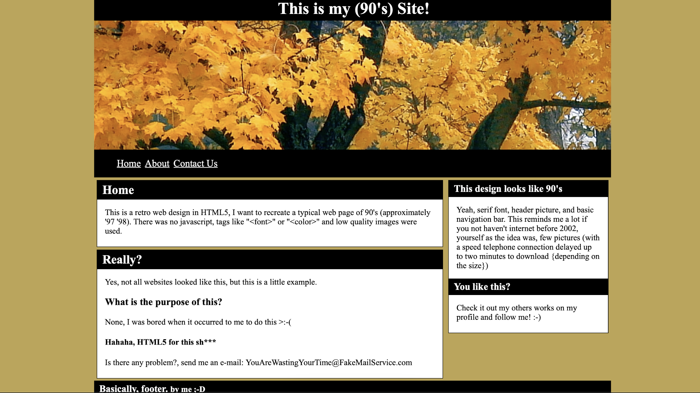

# Ejercicio CSS - 90's Web

### Introducción
En los años 90 y comienzos del 2000, internet acababa de aparecer en el mundo (al menos el internet para los usuarios particulares). CSS todavía estaba poco desarrollado, por lo que las webs de entonces eran rígidas, poco dinámicas y ahora nos parecen viejas.

Pero como tú estás empezando a programar, tus webs también van a ser así, de momento. Por eso, para este ejercicio, debes clonar una web estilo años 90. Intenta llegar al siguiente resultado:

Como puedes ver, tenemos:
- Un `header` con una imagen.
- Un `nav` que nos lleva a distintas páginas (no hace falta que hagas las otras páginas, de momento serán links vacíos). 
- Dos secciones con contenido (texto) que no tienes por qué copiar, puedes inventártelo o poner un `lorem ipsum`.
- Un `aside` con otras dos secciones.
- Un `footer`.

Esos son los elementos básicos que debe tener tu clon, y debe tener más o menos las mismas dimensiones y estructura. El resto de estilos, como los colores, puedes hacerlos a tu gusto o copiarlos de la imagen.

### Iteraciones

1. Crea un repositorio en GitHub llamado "web_arbol", y clónalo a tu ordenador.
2. Crea la estructura de carpetas: un index.html, carpeta de assets, styles, etc.
3. Crea el HTML entero, **prestando especial atención a la semántica**. No tienes que copiar el texto de la web, puedes invertártelo o copiarlo de otro sitio.
4. Da los estilos en tu archivo CSS.
5. Sube el repositorio a GitHub y enlaza el link a la tarea del Google Classroom.
6. Chill.