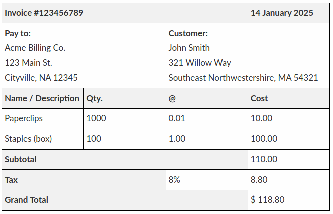

# El Gimnasio de Gervasio

## Introducción

Gervasio tiene un gimnasio y le gustaría digitalizar sus horarios, así que te pide que digitalices una de sus facturas, para ver si queda convencido.

## Pasos ##

1. Crea el archivo `index.html`

2. Sin tener consideración de los atributos `rowspan` y `colspan`, replica la factura mostrada en el enunciado con una tabla completa aquí.

3. Agrega `rowspan` y `colspan` según convenga

4. Agrega estilos de texto

5. Agrega símbolos

6. ¿Habría alguna etiqueta especial que agregar dentro de la tabla? ¡Hazlo!