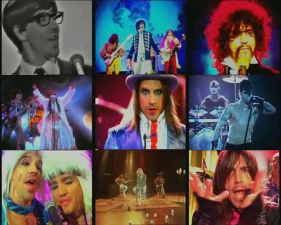

# Práctica HTML: Web tributo

## 1. HTML Básico
Tu grupo favorito de música te ha llamado por teléfono esta mañana porque necesitan tu ayuda. Quieren una página web que muestre al mundo quiénes son y lo bien que tocan.
Lamentablemente, los programadores que contrataron para hacerla murieron de golpe a causa de una intoxicación de marisco mientras celebraban el contrato. Ahora eres su única esperanza.

Debes realizar una web tributo a tu grupo de música favorito. Debe contener, al menos, una página **"home", "about" y "gallery"**:

1. En `home` pondrás una portada con un **título**, una **imagen** del grupo o logo, y una **tabla** con los próximos conciertos (al menos 3, con fecha, ciudad, país y precio de la entrada). 

2. En `about` escribirás una breve historia y descripción del grupo, con alguna imagen de sus miembros. Las imágenes tendrán **pie de página** y **texto alternativo**.

3. En `gallery` pondrás algún video suyo tocando sus canciones más conocidas, con título, y alguna imágen si te apetece.

## 2. Formulario
Añade una página más de HTML, llamada "**contact**", que contenga un formulario de contacto. El formulario debe incluir los siguientes campos:
- Nombre.
- Email.
- Teléfono.
- País (select con al menos 3 opciones).
- Mensaje (textarea).
- Aceptar términos y condiciones (checkbox).

## 3. Estilos
El grupo está muy contento con tu web, todo sea dicho. Pero les gustaría que fuera un poco más... cómo decirlo... ¿bonita? Completa el trabajo dándole estilos a la web: color, fuente, bordes, animaciones... Cuanto más hortera, mejor.