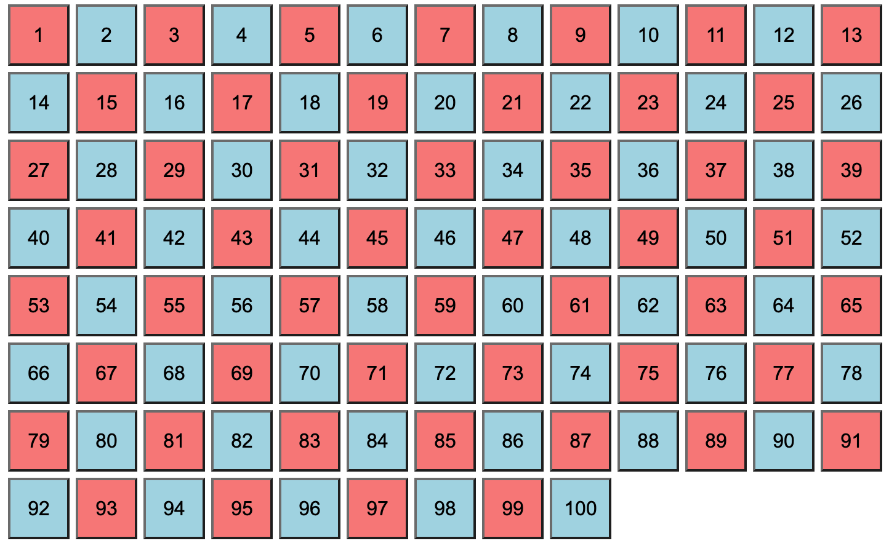

# Ejercicios DOM I

### Ejercicio 1: Café con miras
En este enlace encontrarás una página del proyecto "Café de alura" muy parecida a la que hiciste en su momento. La tarea consiste en que, usando la consola, logres mostrar los siguientes nodos:
1. El logo de la página.
2. EL botón de la cesta de la compara del `header`.
3. Los nombres de los 4 cafés que aparecen en la sección de productos en una colección de HTML.
4. El precio de los 4 cafés de arriba, también en una colección de HTML.
5. Las URL de las imágenes de los 4 cafés, en una colección HTML.
6. Por cada café y usando un bucle, muestra en la consola: `"El café ${nombre_de_café} tiene la imagen ${url_imagen} y un precio de ${precio}"`.
7. La imagen del coffee shop.
8. Todos los inputs del formulario de contacto, `textarea` incluido, en un único array.


### Ejercicio 2: 100 Buttons
Dado el siguiente HTML inicial:
```html
<body>

<section></section>

</body>
```

El ejercicio consiste en crear, usando exclusivamente JavaScript, 100 botones e introducirlos en la `section`.

1. Estos botones tendrán como texto su número: el primer botón tendrá `1`, el segundo `2`, etc.
2. El primer botón tendrá un color de fondo **_rojo_**, el segundo **_azul_**, el tercero **_rojo_**, el cuarto **_azul_**, etc.

Una vez hayas creado los botones, da a cada **_quinto_** botón un color de texto **_verde_**. 




### Ejercicio 3: Rainbow text
Tienes el siguiente HTML:
```html
<div>
	<span>R</span>
	<span>A</span>
	<span>I</span>
	<span>N</span>
	<span>B</span>
	<span>O</span>
	<span>W</span>
</div>
```

En tu archivo `.js` tienes el siguiente array:
```javascript
const colors = ['red', 'orange', 'yellow', 'green', 'blue', 'indigo', 'violet'];
```

La tarea consiste en seleccionar todos los `span`, iterar sobre ellos y asignarle cada uno de los colores del array tal que las letras formen el arcoiris.


### [Ejercicio 4: Fix Wikipedia](./fix_wikipedia)