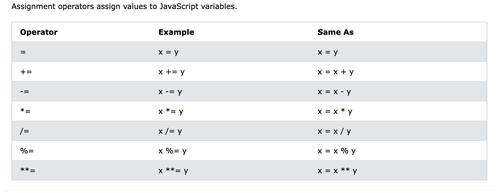
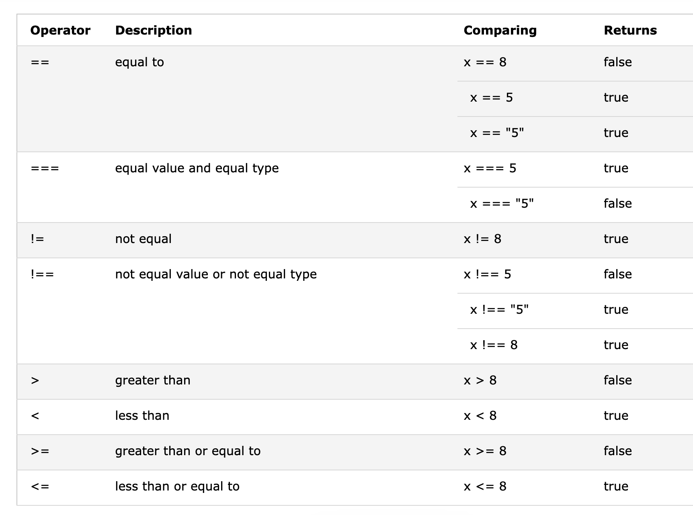

# Operators
### Arithmetic operators
JavaScript permite realizar las operaciones matemáticas básicas usando los signos comúnmente aceptados para ello (`+`, `-`, `*`, `/`):
```javascript
2 + 2 // 4
5 - 3 // 2
10 * 3 // 30
20 / 4 // 5
```

Además de estos, contamos con dos operadores aritméticos más:
-  Modulo o "remainder" `%`: nos da el resto de la división
```javascript
2 % 2 // 0
3 % 2 // 1
```

- Exponente `**`:
```javascript 
3 ** 2 // 9
2 ** 4 // 16
```

### Assignment operator
Como ya dijimos, el signo `=` en JavaScript es un operador, realiza una operación: la de asignar valor a una variable. 
```javascript
let name = "Daniel";
let age = 29;
```

Con este operador también podemos reasignar valor a una variable previamente asignada:
```javascript
let age = 29;
age = 45;
console.log(age); // 45
```

Podemos combinar el operador de asignación con los operadores aritméticos:
```javascript
let age = 30;
age += 2;
console.log(age); // 32

let year = 2020;
year -= 5;
console.log(year); // 2015

//etc.
```



### Comparison operators
Para realizar comparaciones entre datos en JavaScript, también podemos usar los operadores de comparación que usamos en matemáticas:
```javascript
2 < 3 // true
2 > 3 // false
5 <= 5 // true
7 >= 5 // false
```

Como ya sabes, el operador `=` sirve para asignar el valor a una variable. Por lo tanto, el siguiente código **NO** significa "2 es igual a 3", sino "que la variable `2` tenga el valor `3`":
```javascript
2 = 3
```

Pero, entonces, ¿cómo podemos realizar comparaciones de igualdad? Podemos hacerlo de dos formas distintas:

#### Igualdad no estricta `==`
Compara el valor de los datos, no su tipo. No va a tener en cuenta si el dato es un `string` o `number`.
```javascript
2 == "2" // true
3 == "2" // false
```

#### Igualdad estricta `===`
Compara el valor de dos datos, incluido el tipo de dato:
```javascript
2 === "2" // false
3 === 3 // true
```

#### Desigualdad estricta y no estricta
Compara si dos valores son estrictamente desiguales (`!==`) o no estrictamente desiguales (`!=`):
```javascript
2 !== "2" // true
2 != "2" // false
```



### Increment operators
Podemos incrementar cualquier valor usando el operador de incremento:
```javascript
let num = 2;
num++;
console.log(num) // 3

let age = 22;
age--;
console.log(age); // 21
```

### Logical operators
Por último, podemos realizar distintas operaciones lógicas usando los operadores lógicos:

- and `&&`: 
	Devuelve `true` si y sólo si las expresiones escritas a ambos lados del operador son verdaderas (`true`).
- or `||`:
	Devuelve `true` si alguna de las expresiones escritas a ambos lados del operador es verdadera(`true`), no necesariamente las dos.
- not `!`:
	Devuelve lo contrario a la expresión escrita a continuación.
	
```javascript
true && true // true
true && false // false
false && false // false
2 > 1 && 0 < 1 // true
2 === 1 && 0 === 0 // false

true || true // true
true || false // true
false || false // false
2 > 1 || 0 > 1 // true
2 === 1 || 0 === 1 // false

!true // false
!false // true
```
